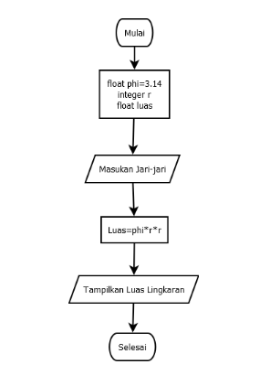

# LATIHAN 1

<strong>Penggunaan End<strong>

print("A", end="")

print("B", end="")

print("C", end="")

print()

print("X")

print("Y")

print("Z")

<strong>Penggunaan separator<strong>

w, x, y, z=10, 15, 20, 25

print(w, x, y, z)

print(w, x, y, z, sep=",")

print(w, x, y, z, sep="")

print(w, x, y, z, sep=":")

print(w, x, y, z, sep="_____")

<strong>string format<strong>

print(0, 10**0)

print(1, 10**1)

print(0, 10**0)

print(2, 10**2)

print(3, 10**3)

print(4, 10**4)

print(5, 10**5)

print(6, 10**6)

print(8, 10**8)

print(9, 10**9)

print(10, 10**10)

<strong>string format<strong>

print("{0:>3} {1:>16}".format(0, 10**0))

print("{0:>3} {1:>16}".format(1, 10**1))

print("{0:>3} {1:>16}".format(0, 10**0))

print("{0:>3} {1:>16}".format(2, 10**2))

print("{0:>3} {1:>16}".format(3, 10**3))

print("{0:>3} {1:>16}".format(4, 10**4))

print("{0:>3} {1:>16}".format(5, 10**5))

print("{0:>3} {1:>16}".format(6, 10**6))

print("{0:>3} {1:>16}".format(7, 10**7))

print("{0:>3} {1:>16}".format(8, 10**8))

print("{0:>3} {1:>16}".format(9, 10**9))

print("{0:>3} {1:>16}".format(10, 10**10))

# LATIHAN 2

a=input("Masukan nilai a:")

b=input("Masukan nilai b:")

print("Variabel a=",a)

print("Variabel b=",b)

print("Hasil penggabungan {1}&{0}=%d".format(a,b) %(a+b))

<strong>Konversi nilai variabel<strong>

a=int(a)

b=int(b)

print("Hasil penjumlahan {1}+{0}=%d".format(a,b) %(a+b))

print("Hasil pembagian {1}/{0}=%d".format(a,b) %(a/b))

# LATIHAN 3

Belum selesai

# LATIHAN 4

r = float(input('Masukkan nilai jari-jari : '))

phi = 3.14 diameter = 2*r

luas = phirr

keliling = phi*diameter

print('\nLuasnya =', str("%.2f" % luas))

print('kelilingnya =', str("%.2f" % keliling))

# Flowchart Menghitung Luas Lingkaran

<strong>Sekian dan terima kasih<strong>

